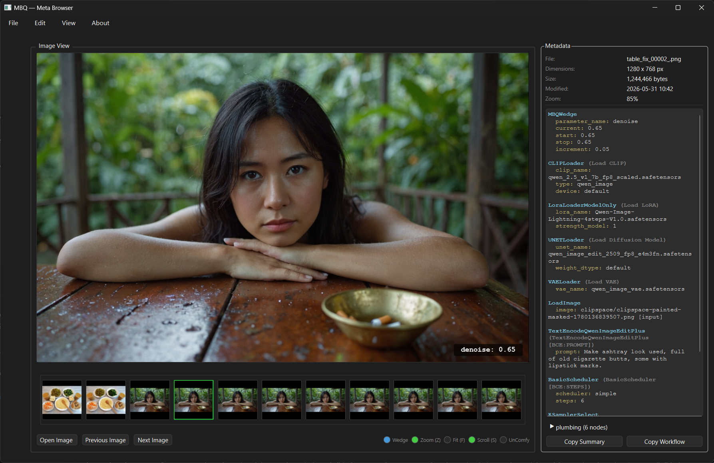

# MBQ Viewer + Wedge Node for ComfyUI



**MBQ is a parameter sweep tool for ComfyUI, built around a tight two-part loop:**

| | |
|---|---|
| **MBQ Wedge** | A ComfyUI custom node that sweeps any numeric parameter across a range — steps, CFG, guidance, denoise — queuing one image per value with a single click. |
| **MBQ Viewer** | An OpenGL-accelerated desktop image viewer that reads the ComfyUI prompt data embedded in each PNG and overlays the swept parameter value directly on the canvas. |

**The loop:** get a result you like in ComfyUI → freeze the seed → add MBQ Wedge and sweep the parameter you're uncertain about → open the output folder in MBQ Viewer → flip through results with the swept value labelled on every image, zoomed in to the exact detail you care about.

Say you like a scene but aren't sure how many steps you need: sweep `steps` 4 → 12. Want to tune an inpaint blend? Sweep `denoise` 0.4 → 1.0 at 0.05 increments. Works with any float or int input on any node.

---

## MBQ Wedge — ComfyUI node

### Install

Copy (or symlink) the `ComfyUI-MBQWedge/` folder into your ComfyUI custom nodes directory and restart ComfyUI:

```
ComfyUI/custom_nodes/ComfyUI-MBQWedge/
```

The node appears under **MBQ → MBQ Wedge**.

### How it works

Add MBQ Wedge to any workflow and wire one output to a numeric input:

| Output | Connect to |
|--------|-----------|
| `int_value` | Any INT input (steps, width, …) |
| `float_value` | Any FLOAT input (CFG, guidance, denoise, …) |

Set `start`, `stop`, and `increment`. Click **Queue once** — the MBQ JS extension intercepts the submission and expands it into N separate jobs, one per sweep value.

Each output PNG has the **exact swept value embedded** in its ComfyUI prompt chunk. MBQ Viewer reads it directly — no guessing, no positional inference. Works correctly across multiple batches and renamed files.

Seeds advance correctly across sweep jobs: randomize, increment, decrement, and fixed modes all work as configured.

### Node display

- **will produce → N iterations** — live count updates as you adjust the range
- **current → X** — shows the starting value; switches to integer display when wired to an INT input

### Example — sweep steps 4 → 12

```
parameter_name = "steps"   (auto-filled when you connect the output)
start          = 4
stop           = 12
increment      = 1
```

Wire `int_value` → BasicScheduler `steps`. Click Queue → 9 jobs, 9 PNGs, each labelled `steps: 4` through `steps: 12` in MBQ Viewer.

---

## MBQ Viewer — desktop viewer

### Install

**Requirements:** Python 3.11+, PySide6

```bash
pip install pyside6
python mbq_viewer.py
```

```bash
python mbq_viewer.py path/to/image.png   # open image + its folder
python mbq_viewer.py path/to/folder/     # open folder
```

Drag images in from Explorer or ComfyUI. Drag thumbnails out to Explorer or ComfyUI.

### Canvas

- OpenGL-accelerated — smooth pan (left-drag), scroll-wheel zoom anchored at cursor
- Middle-click to reset zoom to 100%
- **Zoom Lock (`Z`)** — preserves the exact pan and zoom position when flipping between images, so you can inspect the same crop across an entire sweep
- **Fit Lock (`F`)** — auto-fits every image to the window
- **Reset (`R`)** — 100% zoom, clears both locks

### Workflow panel

Reads the prompt JSON embedded by ComfyUI's SaveImage node and displays it in a colour-coded panel:

- **Tier 1** — models, prompts, sampler params (the things you usually care about)
- **Tier 2** — other scalar values
- **Tier 3** — plumbing nodes (collapsible, hidden by default)

Colour coding: cyan node headers · yellow keys · near-white values

**Copy Summary** — plain-text summary for notes or sharing  
**Copy Workflow** — raw LiteGraph JSON for direct re-import into ComfyUI

**Scroll Freeze (`S`)** — locks the workflow panel's scroll position when flipping between images, so the same section of the metadata stays in view across an entire sweep.

### MBQ Wedge integration

When a swept image is loaded, MBQ Viewer:
- Lights the **Wedge bulb** (blue) in the status bar
- Overlays the swept parameter and value on the canvas corner: `steps: 6`
- Highlights the swept value in the Workflow panel's MBQWedge entry

The overlay is fixed to the canvas corner — unaffected by zoom or pan.

### Keyboard shortcuts

| Key | Action |
|-----|--------|
| `Ctrl+O` | Open image |
| `← / →` | Previous / next image |
| `F5` | Refresh folder |
| `Z` | Toggle zoom lock |
| `F` | Toggle fit lock |
| `R` | Reset zoom to 100%, clear locks |
| `S` | Toggle scroll freeze |
| `Ctrl+Q` | Quit |

---

## Status bulbs

| Bulb | Colour | Meaning |
|------|--------|---------|
| Wedge | Blue | MBQWedge sweep detected in this image |
| Zoom | Green | Zoom Lock active |
| Fit | Teal | Fit Lock active |
| Scroll | Green | Scroll Freeze active |
| UnComfy | Amber | File may be a preview save, not a final output |

---

## File map

| File | Role |
|------|------|
| `mbq_viewer.py` | Main window — layout, menus, navigation, metadata display, filmstrip |
| `mbq_functions.py` | `ImageCanvas` (OpenGL view), `ImageFolder`, `WorkflowCache` |
| `mbq_parser.py` | PNG chunk extraction, ComfyUI prompt graph parsing, three-tier node classification |
| `ComfyUI-MBQWedge/mbq_wedge.py` | MBQWedge ComfyUI node |
| `ComfyUI-MBQWedge/js/mbq_wedge.js` | JS extension: widgets, queue intercept, seed handling |

---

## Notes

- **ComfyUI only.** MBQ reads the `prompt` chunk written by ComfyUI's SaveImage node. A1111, NovelAI, InvokeAI, and other tools are not supported.
- **Soft-fail.** If a PNG has no prompt chunk, MBQ shows the image and leaves the workflow panel blank — it never crashes or shows garbage.
- **No ComfyUI runtime dependency.** MBQ Viewer reads PNG files directly; ComfyUI does not need to be running.
- **Cross-platform.** Developed on Windows; should work on Linux. Mac support is untested.

---

**[github.com/Beakfx/mbq](https://github.com/Beakfx/mbq)**
